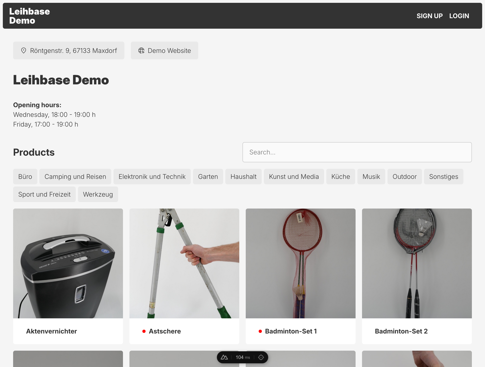
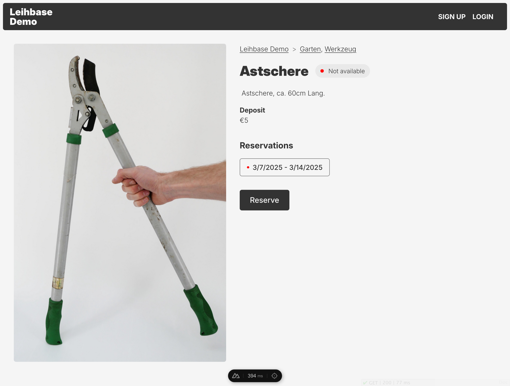
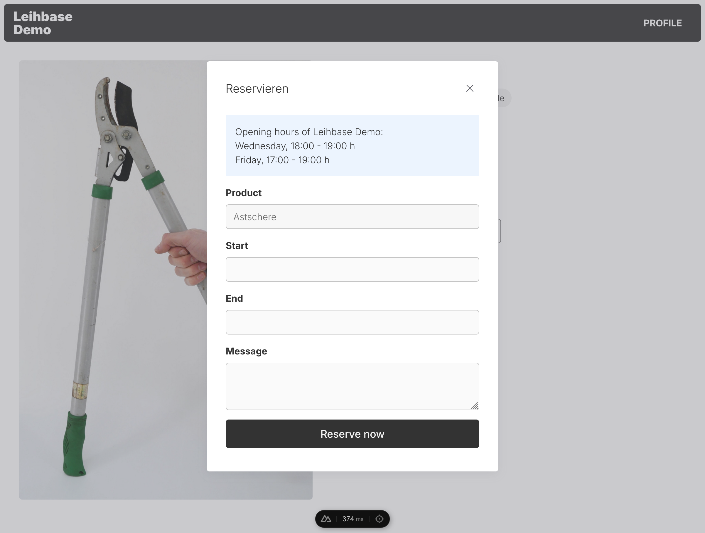
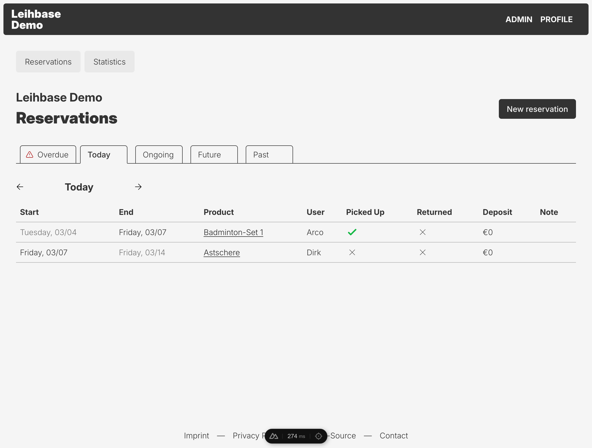
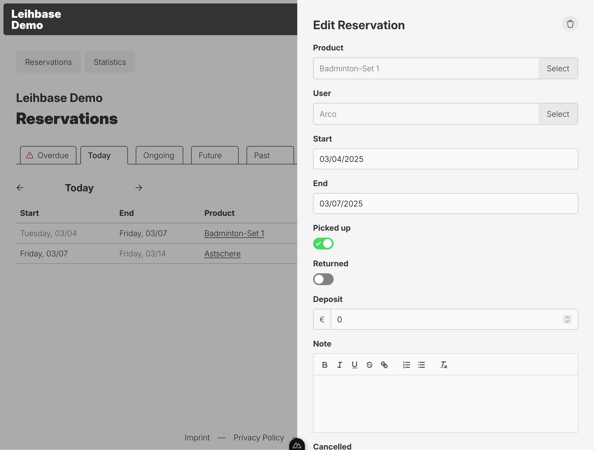
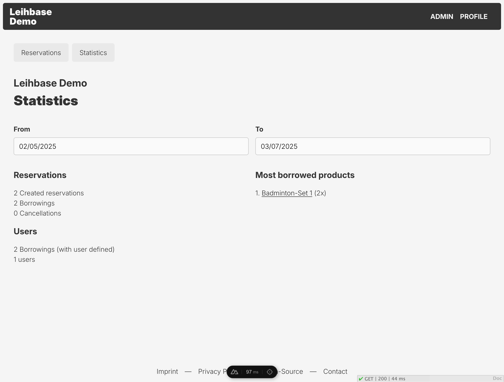

# Leihbase

Web application to manage Leihladen, also known as Borrow Stores.

> [!IMPORTANT]  
> This software is still in active development. It is being used in production
> for the [Leihbar in Cologne](https://leihbar-koeln.de/), but might be lacking
> some (for you) critical features.

## Features

- 🏪 A webshop front-end showing borrowable products
- 🏙️ Manage multiple borrow locations
- 🏷️ Product category filtering
- 🧑‍🤝‍🧑 User sign-up/login
- 🎫 Product reservations
- 👷 A back-end to manage products & reservations
- 📧 Product pickup and return e-mail reminders
- 🎨 Themeable

## Screenshots



## Tech

- Back-end and API using [PocketBase](https://pocketbase.io/)
- Front-end with server-side rendering using [NuxtJS](https://nuxt.com/)

## Deployment

### Docker

Leihbase has two Docker Images available which are both required to set up the application:

- [leihbase-webapp](https://hub.docker.com/r/lumocra/leihbase-webapp)
- [leihbase-pb](https://hub.docker.com/r/lumocra/leihbase-pb)

Use the following docker-compose.yml as a base to deploy Leihbase using Docker:

```yaml
services:
  leihbase-webapp:
    image: lumocra/leihbase-webapp:v1.7.0
    container_name: leihbase-webapp
    environment:
      NUXT_PUBLIC_POCKETBASE_SERVER_BASE_URL: http://leihbase-pb:8080
      NUXT_PUBLIC_POCKETBASE_CLIENT_BASE_URL: <leihbase-pb public url>

  leihbase-pb:
    image: lumocra/leihbase-pb:v1.7.0
    container_name: leihbase-pb
    environment:
      CONFIG_LOCALE: "en"
      # If a reservation (created in the admin section) is required to have a user
      CONFIG_RESERVATION_REQUIRE_USER: "false"
      CONFIG_LENDING_CONDITIONS_LINK: "https://example.com/borrow-conditions"
    volumes:
      - ./pb_data:/pb/pb_data
```

### Fly.io

The repository contains [fly.toml](https://fly.io/docs/reference/configuration/)
files to deploy the service as [fly.io](https://fly.io) applications.

## Development

### Setup

Requirements: [Mise](https://mise.jdx.dev)

```bash
# Install repository tools (mailpit, pocketbase)
$ mise install
# Setup project
$ mise run //...:setup
```

### Run

```bash
# Enable mise monorepo support
$ export MISE_EXPERIMENTAL=1
# Run services
$ mise run //...:dev
```

### Initial content

After starting the service using the setup steps above. Enter some initial data
to be able to use the application:

1. Browse to [localhost:8080/\_/](http://localhost:8080/_/) to visit the Pocketbase
   admin interface
1. Create an admin account
1. Create a record in the leihbase collection, containing some configuration
   settings for the instance
1. Create a location in the locations collection (make sure to set the location
   to as 'active')
1. Create a product in the products collection (make sure to set the product to
   as 'active')
1. Now you should be able to visit [localhost:3000](http://localhost:3000) to
   visit the front-end

### E-mail

When starting the services, [mailpit](https://github.com/axllent/mailpit) also
starts. In Pocketbase ([localhost:8080/\_/](http://localhost:8080/_/) >
Settings > Mail settings) the following SMTP values can be configured:

- SMTP server host: localhost
- Port: 1025
- Username: _\<empty>_
- Password: _\<empty>_

Any sent e-mail can then be viewed in the mailpit web interface at
[localhost:8025](http://localhost:8025).

## Tests

Tests are configured and run using [Playwright](https://playwright.dev/), as the
tests includes visual snapshots tests they are executed
in a docker environment.

### Run tests

```bash
# Run e2e tests
mise run test:e2e
# Run e2e tests, and update visual snapshots
mise run test:e2e
```

## Configuration

### Pocketbase Admin

### Location

#### Notifications

Using the following JSON format the e-mail addresses which should receives
notifications of this location can be configured:

```json
["example@example.com", "sarah@example.com"]
```

#### Links

Links shown on the location page.

```json
[
  {
    "text": "Leihbar Website",
    "link": "https://leihbar-koeln.de"
  }
]
```

#### Opening Hours

Using the following JSON format the opening hours of a location can be
configured:

```json
{
  "days": {
    "tuesday": [
      {
        "from": "18:00",
        "to": "19:00"
      }
    ],
    "friday": [
      {
        "from": "17:00",
        "to": "19:00"
      }
    ]
  },
  "except": {
    "dates": ["2024-12-25", "2024-12-26", "2024-12-31", "2025-01-01"]
  }
}
```

#### Config field

In the config JSON field of a location are the following configurations
available:

`config.allow_same_day_reservations` - Allows a reservation to start on the same
day as that another reservation ends
